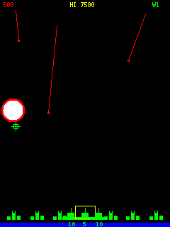
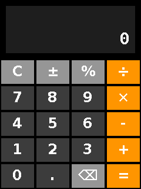
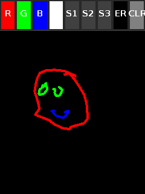
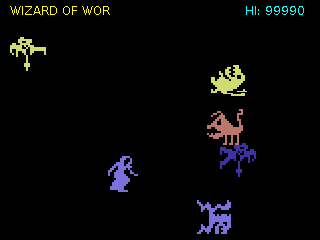
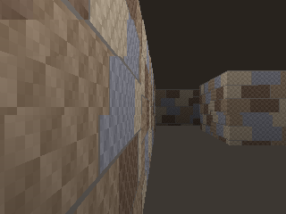
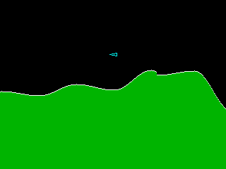

Java UIO Demo provides CLI programs, so you do not have to compile code with hard coded pins, ports, etc.

## Run Periphery demos
To see a list of demos 
[browse](https://github.com/sgjava/javauio2/tree/main/demo2/src/main/java/com/codeferm/periphery/demo)
code. Just pass in --help to get list of command line arguments. Make sure demo2-1.0.0-SNAPSHOT-jar-with-dependencies.jar is in the current directory.

* `java -cp "demo2-1.0.0-SNAPSHOT-jar-with-dependencies.jar" --enable-native-access=ALL-UNNAMED com.codeferm.periphery.demo.GpioOutDemo --help`

## Color Display Demos (Generic Abstract Architecture)

Color display demos now work generically across supported display types using an **abstract color display class (`AbstractColorDisplay`)** architecture. Core application logic and demos are entirely decoupled from specific hardware implementations, utilizing zero-allocation framebuffers, high-performance FFM memory segments, configurable **display rotation** (0, 90, 180, 270), and flexible **hardware/software backlight control with polarity inversion**.

### Supported Color Display Modules
* **Swift-LCD (ST7789):** 1.3"/2.0" IPS TFT LCD screens over a standard 4-wire SPI bus utilizing the ST7789 driver IC.
* **ILI9341 TFT LCD:** 2.2"/2.4"/2.8" TFT LCD screens driven by the ILI9341 controller, supporting advanced PWM backlight options (HW or SW modes) with active-low polarity inversion.
* **SSD1331 OLED:** High-performance full-color OLED displays utilizing RGB565 color mapping and hardware-accelerated buffers.

More on the way.

### Supported Touch Modules
* **XPT2046 Touch Controller:** Resistive touch screen controller utilizing SPI communication, configurable interrupt lines (`--touch-irq-line`), and SPI device paths (`--touch-device`) for interactive touch-based color display demos.

### Graphic Accelerator Commands (GAC) & Software Fallbacks
Hardware acceleration is implemented directly at the display driver level where supported (such as GAC features on the SSD1331). For displays that do not natively support hardware acceleration (such as the ST7789 and ILI9341), transparent software fallbacks are provided, ensuring consistent API usage and drawing capabilities across all hardware modules.

## Run Color Display Demos

Touch screen demos like Missile Command, calculator and paint.

  

Non-touch demos as well.

  
 
To see a list of demos 
[browse](https://github.com/sgjava/javauio2/tree/main/demo2/src/main/java/com/codeferm/periphery/display/demo)
code. Just pass in --help to get list of command line arguments. Make sure demo2-1.0.0-SNAPSHOT-jar-with-dependencies.jar is in the current directory.

* `java -cp "demo2-1.0.0-SNAPSHOT-jar-with-dependencies.jar" --enable-native-access=ALL-UNNAMED com.codeferm.periphery.display.demo.DefenderScroller --help`
* `java -cp "demo2-1.0.0-SNAPSHOT-jar-with-dependencies.jar" --enable-native-access=ALL-UNNAMED com.codeferm.periphery.display.demo.Perf --display-type SSD1331 -d /dev/spidev1.0 -dc 199 -res 198`
* `java -cp "demo2-1.0.0-SNAPSHOT-jar-with-dependencies.jar" --enable-native-access=ALL-UNNAMED com.codeferm.periphery.display.demo.CubeDemo --display-type ST7789 -l false`
* `java -cp "demo2-1.0.0-SNAPSHOT-jar-with-dependencies.jar" --enable-native-access=ALL-UNNAMED com.codeferm.periphery.display.demo.TouchCalculator --display-type ILI9341 -dc 233 -res 76 -led 72 --touch-type XPT2046 --touch-device /dev/spidev1.0 --touch-irq-line 34`

## Run U8g2 demos
To see a list of demos 
[browse](https://github.com/sgjava/javauio2/tree/main/demo2/src/main/java/com/codeferm/u8g2/demo)
code. Just pass in --help to get list of command line arguments. Make sure demo2-1.0.0-SNAPSHOT-jar-with-dependencies.jar is in the current directory.

* `java -cp "demo2-1.0.0-SNAPSHOT-jar-with-dependencies.jar" --enable-native-access=ALL-UNNAMED com.codeferm.u8g2.demo.SimpleText --help`
* `java -cp "demo2-1.0.0-SNAPSHOT-jar-with-dependencies.jar" --enable-native-access=ALL-UNNAMED com.codeferm.u8g2.demo.SimpleText --setup ssd1306_i2c_128x64_noname_f --type I2CHW --bus 1`

### U8g2 Demo Suite: Beyond the Basics

This collection of demos demonstrates the high-performance FFM bindings of JavaUIO, moving from simple text to complex real-time graphics and system monitoring.

### Core Graphics & Performance

* SimpleText.java: The essential starting point. It demonstrates how to initialize the display, select fonts, and render strings with minimal overhead.
Line wrapping is built in as well.

* BufImage.java: Showcases the ability to bridge Java's BufferedImage with U8g2’s native buffers. This is critical for developers who want to use standard Java 2D drawing tools and then "flush" the result to a monochrome OLED/LCD.

### Advanced Visuals & Games

* Raycast.java: A sophisticated demo implementing a "pseudo-3D" raycasting engine (similar to Wolfenstein 3D). It demonstrates that the library is fast enough to handle complex per-pixel calculations and real-time perspective rendering.

* Plasma.java: Creates the illusion of organic, shifting clouds by using three or more overlapping sine waves. Because the display is 1-bit, we use a "dither" or threshold to turn those smooth wave values into a shimmering pattern.

* SpaceInvaders.java: A classic arcade implementation that serves as a masterclass in game loop logic, collision detection, and sprite management within the monochrome constraints of U8g2.

* Centipede.java: A high-performance implementation of the classic arcade game Centipede, optimized for low-resolution displays (128x64 or 128x128). 

* WireframeCube.java uses math and drawing primitives to animate rotating 3D wireframe cube. No cheating with sprites here.

### Real-World Applications

* Video.java: Pushes the boundaries of monochrome displays by streaming video frames. It demonstrates highly optimized buffer transfers to achieve fluid playback on I2C/SPI screens.