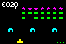
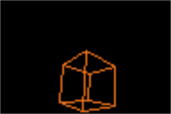
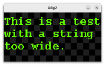
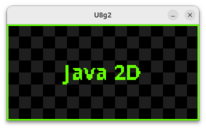
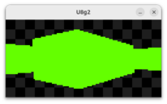
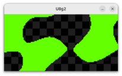
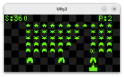
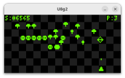
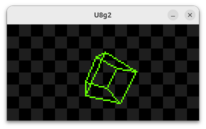
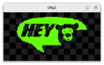

Java UIO Demo provides CLI programs, so you do not have to compile code with hard coded pins, ports, etc.

## Run Periphery demos
 To see a list of demos 
[browse](https://github.com/sgjava/javauio2/tree/main/demo2/src/main/java/com/codeferm/periphery/demo)
code. Just pass in --help to get list of command line arguments. Make sure demo2-1.0.0-SNAPSHOT-jar-with-dependencies.jar is in the current directory.

* `java -cp "demo2-1.0.0-SNAPSHOT-jar-with-dependencies.jar" --enable-native-access=ALL-UNNAMED com.codeferm.periphery.demo.LedBlink --help`

## SSD1331 Java Demos: Rendering Architectures

This showcases high-performance OLED manipulation using the **Java Foreign Function & Memory (FFM) API**. Each demo utilizes a different architectural approach to balance CPU load, bus traffic, and graphical complexity.

### 1. Java2D Demos (Buffered Graphics)
These demos utilize the standard `java.awt.Graphics2D` API. This is the most flexible approach, allowing for complex vector graphics, anti-aliasing, and image manipulation.
* **How it works**: Frames are rendered into a `BufferedImage` in system RAM. The driver then performs a high-speed conversion of the 32-bit `INT_ARGB` buffer into a 16-bit `RGB565` byte stream, which is sent via a single SPI transaction.
* **Best for**: Complex UI elements, fonts, and cross-platform graphical logic.
* **Snapshot**: Automatic; the `BufferedImage` serves as the primary data source.

### 2. GAC Demos (Hardware Accelerated)
These demos leverage the SSD1331's internal **Graphic Accelerator Commands (GAC)** to perform drawing operations directly on the display controller's silicon.
* **How it works**: Instead of calculating pixels in Java, the driver sends high-level instructions (e.g., `DRAW_LINE`, `DRAW_RECTANGLE`, `COPY_WINDOW`). This significantly reduces SPI bus traffic and offloads the heavy lifting from the Raspberry Pi’s CPU to the OLED chip.
* **Best for**: Geometric patterns, scrolling, and windowing operations where CPU efficiency is critical.

### 3. Native Push Demos (Raw Framebuffers)
The "Native Push" approach (as seen in the **Boing** demo) represents the highest tier of performance, bypassing higher-level APIs for a direct-to-silicon pipeline.
* **How it works**: A local `byte[]` array is maintained in `RGB565` format. The demo logic manipulates bytes directly with bit-wise operations. The entire 12,288-byte buffer is then "blasted" to the display in one atomic operation using FFM's `MemorySegment`.
* **Best for**: High-frame-rate simulations, 3D rotations, and flicker-free animations.

### Feature Matrix

| Feature | Java2D | GAC (Hardware) | Native Push |
| :--- | :--- | :--- | :--- |
| **Rendering Surface** | JVM Heap (`BufferedImage`) | SSD1331 Internal RAM | JVM Heap (`byte[]`) |
| **CPU Usage** | Moderate | Very Low | Low-Moderate |
| **SPI Bus Load** | High (Full Frames) | Low (Commands Only) | High (Full Frames) |
| **Flicker-Free** | Yes (Double Buffered) | No (Immediate) | Yes (Direct Buffer) |
| **Snapshot Support** | Native | Not implemented | Not implemented |

## Run SSD1331 Periphery demos
 To see a list of demos 
[browse](https://github.com/sgjava/javauio2/tree/main/demo2/src/main/java/com/codeferm/periphery/ssd1331/demo)
code. Just pass in --help to get list of command line arguments. Make sure demo2-1.0.0-SNAPSHOT-jar-with-dependencies.jar is in the current directory.

## Run U8g2 demos
To see a list of demos 
[browse](https://github.com/sgjava/javauio2/tree/main/demo2/src/main/java/com/codeferm/u8g2/demo)
code. Just pass in --help to get list of command line arguments. Make sure demo2-1.0.0-SNAPSHOT-jar-with-dependencies.jar is in the current directory.

* `java -cp "demo2-1.0.0-SNAPSHOT-jar-with-dependencies.jar" --enable-native-access=ALL-UNNAMED com.codeferm.u8g2.demo.SimpleText --help`

### U8g2 Demo Suite: Beyond the Basics

This collection of demos demonstrates the high-performance FFM bindings of JavaUIO, moving from simple text to complex real-time graphics and system monitoring.

### Core Graphics & Performance

* SimpleText.java: The essential starting point. It demonstrates how to initialize the display, select fonts, and render strings with minimal overhead.
Line wrapping is built in as well.

* BufImage.java: Showcases the ability to bridge Java's BufferedImage with U8g2’s native buffers. This is critical for developers who want to use standard Java 2D drawing tools and then "flush" the result to a monochrome OLED/LCD.

### Advanced Visuals & Games

* Raycast.java: A sophisticated demo implementing a "pseudo-3D" raycasting engine (similar to Wolfenstein 3D). It demonstrates that the library is fast enough to handle complex per-pixel calculations and real-time perspective rendering.

* Plasma.java: Creates the illusion of organic, shifting clouds by using three or more overlapping sine waves. Because the display is 1-bit, we use a "dither" or threshold to turn those smooth wave values into a shimmering pattern.

* SpaceInvaders.java: A classic arcade implementation that serves as a masterclass in game loop logic, collision detection, and sprite management within the monochrome constraints of U8g2.

* Centipede.java: A high-performance implementation of the classic arcade game Centipede, optimized for low-resolution displays (128x64 or128x128). 

* WireframeCube.java uses math and drawing primitives to animate rotating 3D wireframe cube. No cheating with sprites here.

### Real-World Applications

* Video.java: Pushes the boundaries of monochrome displays by streaming video frames. It demonstrates highly optimized buffer transfers to achieve fluid playback on I2C/SPI screens.
